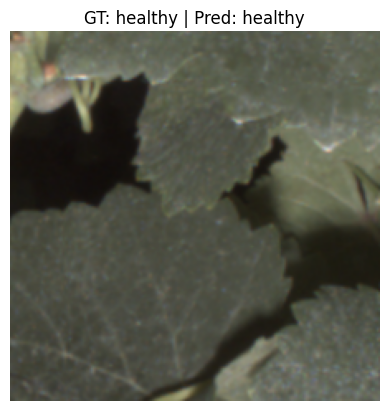
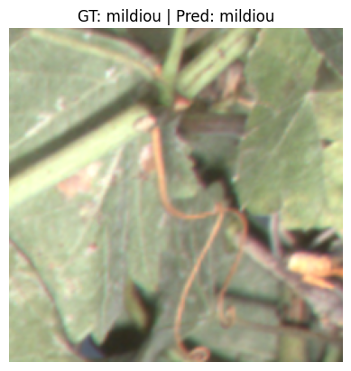

# Image Classification Training – CNN with PyTorch

## Overview

This repository contains a complete educational pipeline for image classification using classical CNN architectures (ResNet, VGG) with PyTorch.

The training session covers:

1. Data preparation
2. Transfer learning
3. Training & validation pipeline
4. Early stopping
5. Model checkpointing
6. Confusion matrix
7. Learning curves : losses, accuracies, confusion matrix
8. Grad-CAM visualization

---

## Dataset preparation pipeline

1. Source dataset (raw images + masks)
2. Image-level split into train/val/test
3. Patch extraction (tiling)
4. Training using ImageFolder

This workflow prevents data leakage between splits.

### Initial dataset used before any processing.
```bash
The directory structure of your datasets **must** follow this structure:
data_src/
├── mask
│   ├── healthy
│   │   ├── image1.png
│   │   └── image2.png
|   |
│   └── mildiou
│       ├── image1.png
│       └── image2.png
│       
└── raw
│   ├── healthy
│   │   ├── image1.png
│   |   └── image2.png
│   └── mildiou
│       ├── image1.png
│       └── image2.png

- raw contains original RGB images.
- mask contains segmentation masks associated with the images.
- Images are organized by class.
Each subfolder ('healthy' and 'mildiou') represents a class.
```

### Dataset Split (image-level split)
```bash
The dataset is split before patch extraction to avoid data leakage.
data_split/
├── train
│   ├── mask
│   │   ├── healthy
│   │   └── mildiou
│   └── raw
│       ├── healthy
│       └── mildiou
│
├── val
│   ├── mask
│   └── raw
│
└── test
    ├── mask
    └── raw

- Splitting is done at image level.
- This prevents patches from the same image appearing in both training and validation/test sets.
```

### Patch Extraction (training dataset)
```bash
After splitting, images are tiled into patches
data_patch/
├── train/
│   ├── healthy/
│   └── mildiou/
├── val/
│   ├── healthy/
│   └── mildiou/
└── test/
    ├── healthy/
    └── mildiou/

- This dataset is the one used by torchvision.datasets.ImageFolder
```
---

## Installation

1. Clone the repository
```bash
git clone https://github.com/djaliloh/Deep-learning-training.git
cd Deep-learning-training
```

2. Create conda environment
```bash
conda create -n cnn_training python=3.10
conda activate cnn_training
```

3. Install requirements
```bash
pip install -r requirements
```
---

## To run the code
- We have 2 ipynb in this repo. 'session1_data_preparation.ipynb' and 'session2_train_cnn.ipynb'
1. Split your data into train, val and test and create patches to feed the network
```bash
Follow instructions in the 'session1_data_preparation.ipynb' to split your data and perform tiling on every split (train, val, test)
```
2. Run training
```bash
Follow instructions in the 'session2_train_cnn.ipynb' to run the training
```
---


## Models
```bash
Supported architectures:

- ResNet18
- ResNet34
- ResNet50
- VGG16

Implemented with torchvision pretrained weights.
```
---


## Transfer Learning
```bash
> Two regimes exist in transfer learning with models such as ResNet-18 or VGG16 implemented in PyTorch / Torchvision.
1. Fixed feature extractor (no unfreezing)
    - conv backbone → frozen
    - classifier head → trainable

2. Progressive fine-tuning (unfreeze later)
    - freeze backbone
    - train classifier head
    - unfreeze upper layers
    - continue training with smaller LR

> Full fine-tuning
1.  Nothing is frozen.
    - conv backbone → trainable
    - classifier → trainable
    * Risk: overfitting. (Works when dataset is large)
```

```bash
- Undersatand traning mode :
| mode        | backbone                          | classifier |
| ----------- | --------------------------------- | ---------- |
| fixed       | frozen                            | trainable  |
| progressive | frozen → partially unfrozen later | trainable  |
| full        | trainable                         | trainable  |
```

```bash
- Prediction examples

| Image | Ground Truth                 | Prediction           |
|-------|------------------------------|----------------------|
|  | healthy    | healthy |
|       | mildiou    | mildiou |
|                 | healthy    | mildiou |
```


## Contact
- Ousseini Hamza Abdoul Djalil - Engineer (abdouldjalilo@gmail.com)
- Rousseau David - Professor