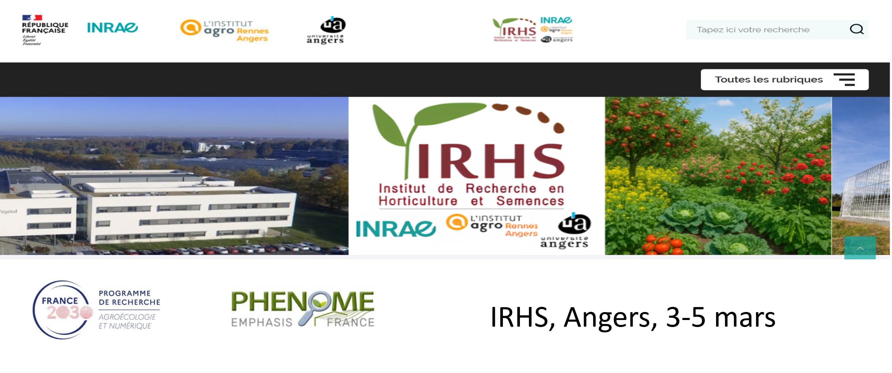
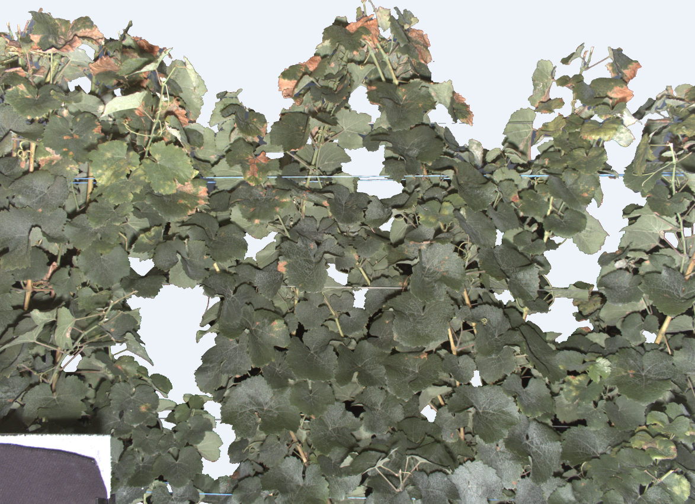
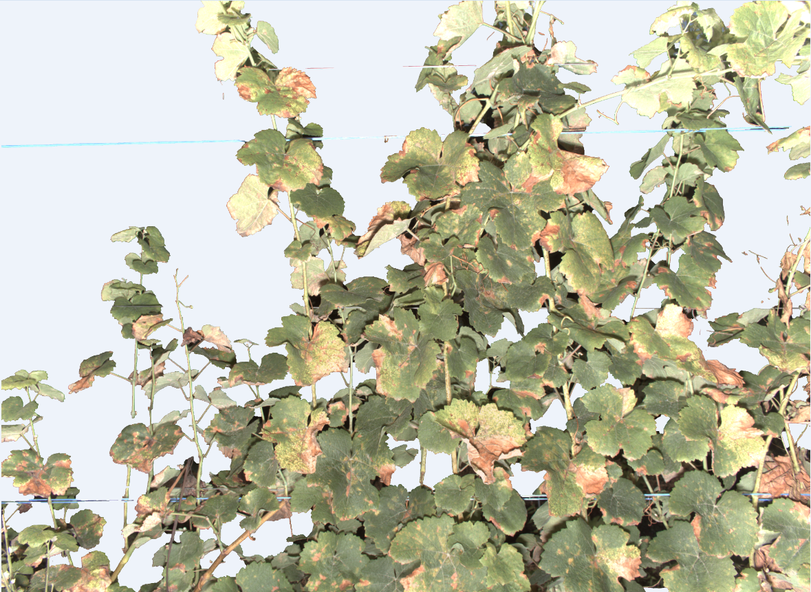
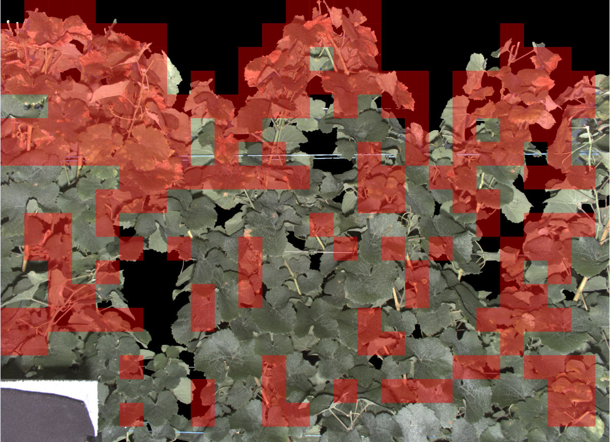
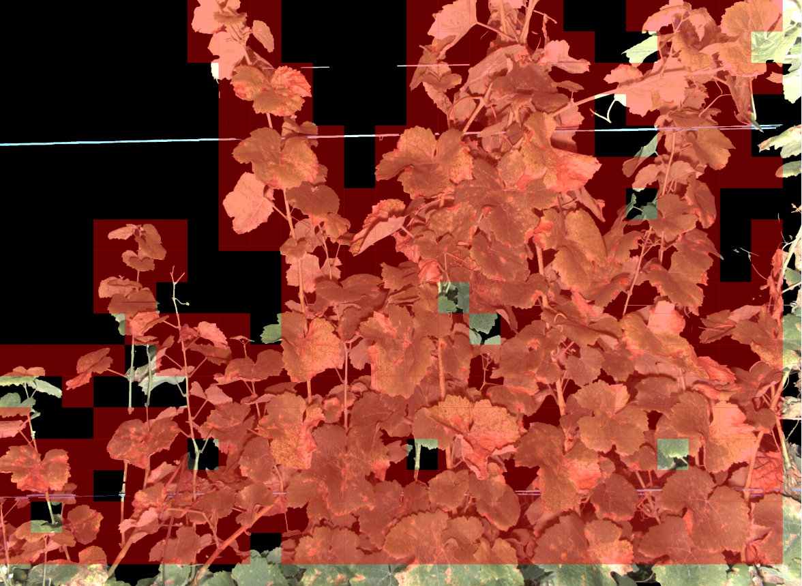

# Image Classification Training – CNN with PyTorch

<p align="center">
    
</p>

[](https://pytorch.org/)
[](https://opensource.org/licenses/MIT)

This repository provides an educational pipeline for image classification using **Transfer Learning** with classical CNN architectures (ResNet, VGG).

## ⏱ Quick Start

1. **Prepare**: Open `session1_data_preparation.ipynb` to tile your images.
2. **Train**: Open `session2_train_cnn.ipynb`, set your hyperparameters, and run.
3. **Analyze**: Open `session3_inference.ipynb` to see predictions and Grad-CAM maps.


## Features
The training session covers:
* **Data preparation:** Image-level splitting and patch extraction.
* **Transfer learning:** Multiple training regimes (Fixed, Progressive, Full).
* **Pipeline:** Early stopping, model checkpointing, and learning curves.
* **Evaluation:** Confusion matrices and **Grad-CAM** visualization.

---

## Dataset Preparation Pipeline

To prevent **data leakage**, we split the dataset at the image level *before* extracting patches. This ensures that patches from the same physical image never appear in both the training and validation sets.

### 1. Source Structure (Raw)
```text
data_src/
├── mask/
│   ├── healthy/ (image1.png, ...)
│   └── mildiou/ (image1.png, ...)
└── raw/
    ├── healthy/ (image1.png, ...)
    └── mildiou/ (image1.png, ...)
```

### 2. Intermediate Split (Image-Level)
```text
data_split/
├── train/ (mask/raw)
├── val/   (mask/raw)
└── test/  (mask/raw)
```

### 3. Final Patch Dataset (Tiled)
```test
This dataset is the one used by torchvision.datasets.ImageFolder.
data_patch/
├── train/
│   ├── healthy/
│   └── mildiou/
├── val/
│   ├── healthy/
│   └── mildiou/
└── test/
    ├── healthy/
    └── mildiou/
```

## Installation
```Bash 
1. Clone the repository
git clone [https://github.com/djaliloh/Deep-learning-training.git](https://github.com/djaliloh/Deep-learning-training.git)
cd Deep-learning-training
```

```Bash
2. Create conda environment
conda create -n cnn_training python=3.10 -y
conda activate cnn_training
```

```Bash
3. Install requirements
pip install -r requirements.txt
```

## How to Run (Workflow & Execution)
```text
The project is divided into three sequential Jupyter notebooks:

    1. Data Preparation: Open **session1_data_preparation.ipynb**. Follow the instructions to perform the image-level split and patch tiling.

    2. Model Training: Open **session2_train_cnn.ipynb**.
        Navigate to the Configuration cell to adjust hyperparameters (Learning Rate, Epochs, etc.).
        Execute the Run training cell to begin the process.

    3. Inference & Grad-CAM: Open **session3_inference.ipynb**.
        Navigate to the Run inference cell to configure your test parameters.
        Follow the remaining instructions to visualize model predictions and Grad-CAM heatmaps.
```

## Transfer Learning Theory

We support **ResNet18, ResNet34, ResNet50, and VGG16** with pretrained weights.

### Training Modes

| Mode | Backbone | Classifier | Best Use Case |
| :--- | :--- | :--- | :--- |
| **Fixed** | Frozen | Trainable | Small datasets; prevents overfitting. |
| **Progressive** | Frozen → Unfreeze later | Trainable | Fine-tuning upper layers for better accuracy. |
| **Full** | Trainable | Trainable | Large datasets; full gradient updates. |

In **Full Fine-tuning**, the gradients are backpropagated through all layers $L$, updating weights $\theta$ according to:

$$\theta_{t+1} = \theta_t - \eta \nabla J(\theta_t)$$

where $\eta$ is the learning rate, which is typically kept very small (e.g., $10^{-5}$) to avoid destroying the pretrained features.


## Model Predictions

| Perspective | Sample 1 | Sample 2 |
| :--- | :---: | :---: |
| **Ground Truth (GT)** |  |  |
| **Prediction** <br> (Overlay diseased on GT) |  |  |


## Contact
- Ousseini Hamza Abdoul Djalil - Engineer (abdouldjalilo@gmail.com / abdoul-djalil.ousseini-hamza@inrae.fr)
- Rousseau David - Professor (david.rousseau@univ-angers.fr)


